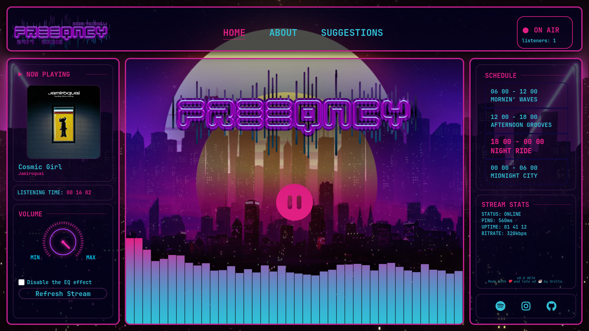

<center>


### *A self-hosted real-time internet radio platform.*


---

*A modern, self-hosted internet radio built around a real-time audio streaming pipeline.*

---
</center>
# ✨ Overview

FREEQNCY is an *internet radio platform* that continuously broadcasts music in real time.

Unlike a traditional music player, every listener hears exactly the same song at the same moment, just like a conventional FM station.

The project is intended both as a fully functional radio station and as a technical portfolio project demonstrating real-world backend, networking and streaming concepts.

It is also expected to serve as a model, enabling anyone who wishes to seriously launch a radio station to do so by using this project as a guide.

As an avid music lover, the station will broadcast songs that match my musical tastes 24/7: rock, fusion, prog, pop, city pop, bossa, among others...!


---

# 📸 Preview


<p align="center"></p>

---

# 🚀 Features

- 🎵 24/7 automated music playback
- 📡 Real-time audio streaming
- 🌍 Multiple synchronized listeners
- 📻 Icecast streaming server
- ⚙️ Liquidsoap automation
- 🖥️ Retro web player
- 📱 Responsive interface
- 🔄 Automatic metadata updates

---

# 🏗️ Architecture

> In development.

<!--
```text
              Music Library
                    │
                    ▼
              Liquidsoap
        (playlist automation)
                    │
      Audio + Metadata Pipeline
                    │
                    ▼
                Icecast
          (streaming server)
                    │
           HTTP Audio Stream
                    │
         ┌──────────┴──────────┐
         ▼                     ▼
      Web Player            VLC / Apps
```
-->
---

# 🛠️ Tech Stack

### Backend


### Streaming


### Frontend


---

# 📂 Project Structure

```text
FREEQNCY
│
├── backend/
├── frontend/
├── liquidsoap/
├── icecast/
├── music/
├── assets/
├── docs/
└── README.md
```
-->
---

# 🎯 Roadmap

- [x] Configure Icecast
- [x] Configure Liquidsoap
- [x] Stream local audio
- [X] HTTPS
- [X] Custom frontend
- [X] Live metadata
- [X] Album artwork
- [X] Listener counter
- [X] Mobile support
- [ ] Better Player
- [ ] Status Recognition
- [ ] Documentation

---

# 📖 Documentation

Documentation will be available inside the `/docs` directory.

---

# 🤝 Contributing

Contributions, suggestions and feedback are always welcome. I'm always learning more!

---

# 📄 License

This project is licensed under the MIT License.

---

<div align="center">

### Made with ❤️ and lots of ☕ by Grillo.

**FREEQNCY**

*Broadcasting music. Learning infrastructure.*

</div>
